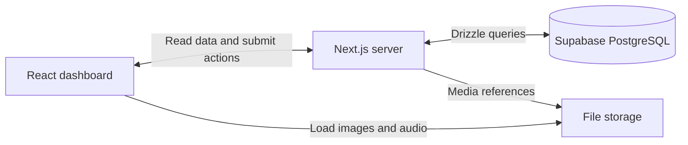

# Toph architecture proposal

Current implementation: see [system map](system-map.md), [mobile API](backend/mobile.md),
and [recording processing](backend/transcription.md). The original proposal below is historical.

Status: proposed for discussion, September 16, 2026. The user confirmed that the first version is an interview submission with persistent sample data. Frontend implementation and deployment have not started.

**Recommendation:** one Next.js App Router application using React and TypeScript, custom CSS Modules, and PostgreSQL hosted by Supabase. Use Drizzle for database queries and versioned schema migrations. Vercel is the proposed application host; hosting accounts and plans are not provisioned by this proposal.

**How this meets the data-shape requirement**

The brief requires the backend data to reflect the shape of the data on the page. Treat this as an explicit acceptance criterion: each visible employee log corresponds to a stored log record, and opening that row reveals details associated with the same record ID. The farm identity, statistics, log rows, and expanded details all have backend representations.

The following mapping makes that requirement reviewable. It is our proposed technical interpretation of “shape,” rather than a claim that the brief specifies a particular database technology.

| Page data | Persistent representation | Data delivered to the interface |
| --- | --- | --- |
| Bays Ranch and avatar | Farm name and avatar asset reference | `farm.name`, `farm.avatarUrl` |
| Employee column | Employee record referenced by a work log | `log.employee.id`, `log.employee.name` |
| Activity column | Work-log activity | `log.activity` |
| Date column | Work-log date/timestamps in the farm's timezone | `log.date` |
| Field column | Field record referenced by a work log | `log.field.id`, `log.field.name` |
| Time column | Typed start and end timestamps | `log.startAt`, `log.endAt` |
| Expanded summary | Text on that same work log | `log.summary` |
| Recording and waveform | Media reference and associated metadata on that log | `log.recording` |
| Expanded map | Field map asset reference; optional verified coordinates | `log.field.mapImageUrl`, optional location |
| Tags | Tag records and log/tag associations | `log.tags` |
| Dashboard cards | Count queries where definitions are known; dated sample metric values where they are not | `metrics` |

The backend can expose a `dashboard_logs` SQL view with one row per log and columns corresponding directly to the visible table. A small server-side mapping function then supplies the expanded fields and nested objects. A view is a named query over the stored records, so an employee's name can be maintained once while still appearing in every relevant dashboard row.

For example, the interface-facing contract would have this shape:

```ts
type DashboardData = {
  farm: { id: string; name: string; avatarUrl: string };
  metrics: {
    recordingsToday: number;
    newRecordings: number;
    activeWorkers: number;
    responseAccuracy: number | null;
    asOf: string;
  };
  newLogCount: number;
  logs: Array<{
    id: string;
    employee: { id: string; name: string };
    activity: string;
    date: string;
    field: { id: string; name: string; mapImageUrl: string | null };
    startAt: string;
    endAt: string;
    summary: string;
    recording: {
      url: string;
      durationSeconds: number;
      waveformPeaks: number[];
    } | null;
    tags: Array<{ id: string; label: string }>;
  }>;
};
```

This is a contract proposal, not implemented code. Audio metadata must come from an actual audio asset; the exported decorative waveform alone does not establish audio duration or content.

**Why this stack**

| Choice | Reason for this project | Tradeoff |
| --- | --- | --- |
| Next.js with React and TypeScript | UI, server reads, and mutations in one repository and deployment. TypeScript makes the data contract explicit. | Requires understanding which code runs on the server versus in the browser. |
| CSS Modules and CSS variables | Direct control over the supplied dimensions, spacing, typography, borders, and state differences. | More custom styling than adopting a ready-made component theme. |
| PostgreSQL | Employees, fields, logs, and tags have relationships; filters and counts fit relational queries. | Schema changes require migrations. |
| Supabase | Managed PostgreSQL and a file-storage option for recordings. | Another hosted service to configure; plan limits should be checked at deployment. |
| Drizzle | TypeScript schemas, SQL-oriented queries, and migrations that can be explained in the interview. | An extra library; plain SQL would also be reasonable. |
| Vercel | Straightforward deployment of the proposed Next.js application. | Host-specific configuration; the application should retain a standard Node deployment path. |

React is the interface library; Next.js builds on React and supplies the application framework. PostgreSQL is the database. Next.js supports server components for data access and client components for interactions. Our initial dashboard read can use a server component; row expansion, audio controls, and menus use client components. See the official [Next.js server/client component guidance](https://nextjs.org/docs/app/getting-started/server-and-client-components).

PostgreSQL can enforce relationships using [foreign keys](https://www.postgresql.org/docs/current/tutorial-fk.html). For example, a log can reference an existing employee and field. Its [JSON support](https://www.postgresql.org/docs/current/datatype-json.html) also leaves room for structured extraction metadata if a transcription pipeline is added later. Core filterable fields should remain typed columns.

Firebase is a viable alternative. Firestore stores documents in collections, and a document can closely resemble an expanded log. It can satisfy persistence and the data-shape requirement. PostgreSQL is our preference because of this application's relationships and reporting needs. Firebase also offers PostgreSQL through SQL Connect, formerly Data Connect, so “Firebase versus Postgres” is not a strict either/or choice. Sources: [Firestore data model](https://firebase.google.com/docs/firestore/data-model), [Firebase SQL Connect](https://firebase.google.com/docs/sql-connect).

Supabase supplies an actual managed [Postgres database](https://supabase.com/docs/guides/database/overview) and separate [file storage](https://supabase.com/docs/guides/storage). Drizzle supports [SQL-oriented typed schemas and queries](https://orm.drizzle.team/docs/overview) and [Supabase connections](https://orm.drizzle.team/docs/connect-supabase). Next.js documents [CSS Modules](https://nextjs.org/docs/app/getting-started/css), and Vercel documents its [Next.js deployment support](https://vercel.com/docs/frameworks/full-stack/nextjs). These capabilities support the proposal; the selection itself is a project-specific judgment.

**Runtime structure**



Start with one application. A separate Express service, GraphQL layer, or microservice deployment is unnecessary for the agreed dashboard scope. Keep database access in a server-only module and business operations in small functions such as `getDashboard` and `addLogTag`. Those functions can later serve mobile-facing HTTP endpoints if the scope expands.

The proposed initial tables are `farms`, `employees`, `fields`, `work_logs`, `tags`, and `work_log_tags`. Add a dated `dashboard_metric_snapshots` table for supplied sample KPIs whose calculation is undefined. This represents actual dashboard information with explicit provenance, rather than embedding those values in JSX.

Store audio files in object storage and keep their references in the database. Original fixed design images can ship as static assets. For this demo the map can expand the exact supplied image; a live map provider is unnecessary unless interactive geographic behavior becomes a requirement. Do not infer real field coordinates from the satellite screenshot.

Use database foreign keys, a unique log/tag pair, and validation of tag labels and timestamps. Start indexes around farm/date filtering and log/tag lookup. Keep database credentials on the server and use a restricted application database role. Use an appropriate pooled connection for the deployment runtime; pooled connection behavior is documented in the Drizzle/Supabase guide above.

**State and persistence**

Business data lives in PostgreSQL. Expanded row IDs, checkbox selection, open dialogs, and playback position are temporary interface state. Search, sort, and filter choices can live in URL parameters so refresh and navigation preserve the selected view.

The clearest write operation already present in the design is Add Tag. The acceptance demonstration is: add a tag, confirm success after the database write, reload or reopen the application, and see the saved tag on the same log. Seed data is loaded deliberately through a seed command, never rewritten on every request. Browser local storage alone does not meet the backend requirement.

For the agreed sample-data submission, use a demo farm context and narrowly scoped demo operations. Real user authentication and multi-farm authorization are outside this first milestone. The surrounding sidebar labels remain visually faithful, but building all of those destinations is a separate scope decision.

**Design ambiguities and proposed defaults**

- The default export contains four log entries; the expanded export contains eleven. Use one stable dataset, with a compact four-row viewport in the default state and the remaining entries accessible by scrolling. Opening a row changes presentation, not the set of underlying records. This is a proposed reconciliation of the references.
- The heading says New Employee Logs (4), while the expanded source has eleven records. Proposed semantics: four records are new/unreviewed. The meaning is not defined by the brief and should be documented as a demo assumption.
- Preserve the card values 5, 1 New, 12, and 90 for the reference state. “Response Accuracy” has no supplied formula or evaluation dataset. Store it as a supplied sample metric with an as-of date; do not describe it as measured transcription accuracy. Other cards should be calculated only after their counting rules are defined.
- The sample dates are in April 2026. Use an explicit April demo period for the initial This Month filter, documented in the README, so the reference records remain visible when the actual calendar advances. Keep date filtering itself functional.
- Only Isaac's expanded details are supplied. Additional details for other logs would be labeled sample fixtures in project documentation. An actual log recording has not been supplied; the attached screen recording has no audio stream. Use a disclosed sample clip if no original is available.
- Preserve literal visual differences between the default and expanded references where specified, including the month-chip text. Avoid silently treating inconsistent reference counts as a proven business rule.

**Implementation sequence after architecture discussion**

1. Establish the shared data contract and seed fixture; implement the two reference states with original assets and scoped CSS.
2. Match scrolling from the recording, then add expansion/collapse, selection, search, sorting, filtering, audio playback, tagging, and map expansion.
3. Connect the same contract to PostgreSQL and verify persistence. Document demo-only assumptions and the schema rationale.
4. Verify the default and expanded views at 1676 × 955, plus the recorded scroll states. Use overlays/diffs against the original exports, followed by functional checks for expansion and saved tags.
5. Deploy the complete application and verify the hosted behavior using the same fixtures and acceptance checks.

The design target is exact visual fidelity at the reference dimensions. Browser text rasterization can vary across environments, so fix the browser, font files, viewport, zoom, device scale, data, and animation state for comparisons. [Playwright's visual comparison guidance](https://playwright.dev/docs/test-snapshots) describes screenshot assertions and environment-dependent rendering. A passing screenshot generated from our own application is not, by itself, proof of fidelity to Figma; compare to the supplied references first.

See [design-review.md](design-review.md) for measured reference details and retained source files.
