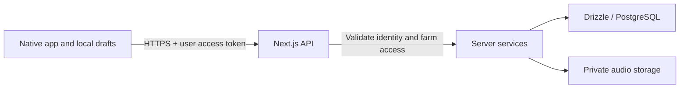

# Mobile connection boundary

The iOS and Android apps should use the same Next.js API. The server validates the user,
derives their farm and employee identity, and writes through Drizzle to PostgreSQL. Database
credentials stay on the server. Audio belongs in private object storage; PostgreSQL stores
its durable object reference and recording metadata.



This is the intended connected architecture. **Mobile sync is currently disabled.** No auth,
database, bucket, or remote service was configured as part of this preparation.

## Implemented now

- `src/contracts/mobile.ts`: the submission and committed-receipt types, shared with Expo
  through type-only `@toph/contracts/*` imports. Existing dashboard contract v2 is unchanged.
- `mobile/src/features/recording/submission.ts`: converts a saved native draft into upload
  metadata and a native audio descriptor. It preserves notes, transcript, treatment details,
  tags, business date, and wall-clock times. It rejects sample recordings and invalid details.
- `mobile/src/lib/api/mobile-client.ts`: injectable native HTTP client with bearer tokens,
  multipart audio, cancellation, timeout, typed API errors, and receipt validation. No
  construction-time requests, environment defaults, automatic retries, or local deletions.
- `POST /api/mobile/v1/logs`: reserved endpoint returning HTTP 503 with
  `MOBILE_SYNC_DISABLED`. It does not parse the body or import auth, storage, or database code.

The app's Save action still calls local `saveDraft`. No screen imports the new client or
submission adapter. Transcription is a separate, implemented local endpoint; see [transcription setup](transcription.md). It does not enable log submission or database persistence. Multi-clip drafts are explicitly rejected by the future single-file submission adapter so appended audio cannot be silently dropped.

## What the eventual call looks like

Illustrative integration only; this is not run by the app:

```ts
import { createMobileApiClient } from "@/lib/api/mobile-client";
import { prepareLogSubmission } from "@/features/recording/submission";

// apiOrigin, authSession, draft, and selectedField come from the future integration.
const api = createMobileApiClient({
  baseUrl: apiOrigin,
  getAccessToken: () => authSession.getAccessToken(),
});
const submission = prepareLogSubmission(draft, selectedField.id);
const receipt = await api.submitLog(submission);
// After a confirmed commit, save receipt.logId beside the local draft.
```

`createMobileApiClient()` with no configuration is valid and inert. Attempting to submit
throws `NOT_CONFIGURED` before calling fetch. Even a configured client currently receives
`MOBILE_SYNC_DISABLED` from the reserved route.

The native multipart request has `metadata` (JSON) and optional `audio` (file bytes). The
transport sets the multipart boundary. The API origin must be HTTPS, without a path or
credentials. Tests inject fake fetch; a future local device test may explicitly pass
`allowInsecureHttp: true`. A physical phone's localhost is the phone, so connecting to this
Mac later will require a reachable development origin and an explicitly configured server
binding. None of those settings have been changed.

The metadata deliberately excludes the draft's local `farmId`, employee identity, and file
URI. Those profile values are placeholders, not proof of identity. `fieldId` must come from
the future authenticated field catalog and must be checked again on the server. The server
resolves the farm timezone and converts the submitted date/time to instants, rejecting
ambiguous/nonexistent daylight-saving times. The current form supports work within one day.

## Work required before enabling

1. Add real sign-in (Supabase Auth fits the intended stack), validate access tokens on the
   server, and map users to farm membership and employee records. Enforce permissions on
   every mobile read and write. The web app's configured farm and demo profile switching
   are not mobile authentication. Do not spoof the web API's Origin header or relax its
   write checks to get mobile working.
2. Implement server validation for the multipart payload, recording MIME type, actual file
   content, maximum duration/size, field membership, tags, and all captured fields. Client
   validation is only convenience. Choose deployment upload limits before enabling this
   multipart endpoint; longer recordings should use a separate signed direct-upload flow
   rather than buffering large files through the application server.
3. Add private storage and a durable object key. Use authorized downloads/signed playback
   URLs rather than a public bucket, and do not persist expiring signed URLs. Clean up
   uncommitted uploads after failures.
4. Add migrations for user/employee membership, any missing treatment data, and submission
   deduplication. The current work-log schema cannot retain product, amount, and unit; do
   not silently discard them. The runtime database role currently lacks log-insert grants.
5. Commit the log, tags, recording reference, and deduplication receipt transactionally.
   Scope uniqueness by authenticated account/farm and `clientDraftId`. Repeated identical
   submissions must return the same stored `logId`; changed payloads under an existing key
   must return 409. The client already sends `Idempotency-Key: <clientDraftId>`, but the
   disabled server does not implement deduplication yet. A later edit to a committed log
   needs a separate update operation.
6. Wire sign-in, the field catalog, and an explicit sync action into the app. Persist receipts
   and retry state before implementing background sync. Preserve local audio until a
   confirmed receipt; timeout or cancellation may occur after a server commit, so retry
   the same submission ID. Verify the full path against isolated actual PostgreSQL and
   private storage before enabling it for real data.

## Verification

`npm run test:unit` tests the disabled route without database setup. From `mobile/`,
`npm test -- --runInBand` covers submission mapping, missing configuration/auth, HTTPS
requirements, multipart encoding, stable retry keys, errors, cancellation, timeouts, and
receipt validation using fake network transports. Typecheck both packages with
`npm run typecheck` in each directory. These checks do not verify persistence or sign-in.

References: [Expo SDK 57](https://docs.expo.dev/versions/v57.0.0/),
[Supabase database connections](https://supabase.com/docs/guides/database/connecting-to-postgres),
[Supabase private storage access](https://supabase.com/docs/guides/storage/security/access-control).
