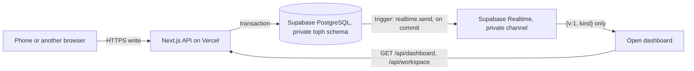

# Dashboard live updates

An open web dashboard shows a phone's newly synced log, and profile or photo edits, without a
page reload. Supabase Realtime carries a **signal**; the data itself is always read again
through the existing `/api/dashboard` and `/api/workspace` routes.

## What is sent, and what is not

- Migration `0007_realtime_notifications.sql` adds `toph.notify_farm_change()` and row
  triggers on `work_logs`, `work_log_tags`, `employees`, `fields` (kind `dashboard`) and
  `workspace_state` (kind `workspace`). The function calls Supabase's
  [`realtime.send()`](https://supabase.com/docs/guides/realtime/broadcast#broadcast-from-the-database)
  with payload `{"v":1,"kind":"dashboard"|"workspace"}`, event `change`, on the **private**
  topic `toph:farm:<farm UUID>`.
- The payload never contains rows, IDs, names, notes, transcripts, photos, or anything about
  recordings. No `toph` table is added to a Realtime publication, "Postgres Changes" is not
  used, and the `toph` schema stays closed to `anon`, `authenticated`, and `service_role`.
- The message is written inside the changing transaction: subscribers hear about commits only,
  a rollback emits nothing, and one transaction emits at most one signal per kind however
  many rows it touches (a phone log with clips and tags is one `dashboard` signal; a phone
  profile edit is one `dashboard` plus one `workspace`). A Realtime problem only raises a
  database warning; it can never fail the farm's own write.
- On PostgreSQL without Supabase Realtime (the local Docker database, the test database) the
  function finds no `realtime.send` and does nothing.

## Who may listen

`npm run db:enable-realtime` creates one row-level-security policy on Supabase's
`realtime.messages` table: role `anon` may **receive** broadcasts whose topic matches
`toph:farm:<uuid>`. There is no send policy, so a browser can listen but cannot publish; a
signal can only come from a committed change inside the database. Without this policy the
private channel refuses every subscriber.

The browser connects with the project's publishable key, which is public by design and maps
to `anon`. With the shared farm profiles there is no per-user identity to check, which is why
the channel carries nothing worth protecting: anyone who can open the website can already read
the same data through the API. The most a listener learns is that *something* changed for a
farm UUID, which the dashboard API already returns. No database credential, service-role key,
secret key, or JWT secret is added to Vercel or sent to a browser. `GET /api/realtime` serves
the public values at request time (so no `NEXT_PUBLIC_` variable is needed) and refuses to
forward anything but an `sb_publishable_…` key or a legacy JWT whose role is exactly `anon`.

## Setup

1. Apply migrations with the owner connection (operator step, never a Vercel build step):
   `npm run db:migrate`.
2. Allow receiving: `npm run db:enable-realtime`. It is idempotent and prints a report;
   `npm run db:enable-realtime -- --check` reports without changing anything. It verifies the
   triggers, that no private table is published, the receive-only policy, and that the
   database can write a signal (the probe is rolled back, so nothing is broadcast).
3. Give the web server the two public values (Vercel → Settings → Environment Variables →
   Production, and `.env.local` when developing against a Supabase project):

   | Name | Value |
   | --- | --- |
   | `SUPABASE_URL` | `https://<project-ref>.supabase.co` (Supabase → Project Settings → Data API) |
   | `SUPABASE_PUBLISHABLE_KEY` | The publishable key `sb_publishable_…` (Project Settings → API Keys). A legacy `anon` key also works, here or as `SUPABASE_ANON_KEY`. Never the secret or `service_role` key. |

   Leaving either unset turns live updates off; everything else keeps working and
   `/api/realtime` answers `{ "data": { "enabled": false } }`.
4. Optional hardening in Supabase → Realtime → Settings: turn off **Allow public access**, so
   the project accepts private channels only. Toph uses no public channel.

Nothing else is required: Realtime is part of every Supabase project, and Vercel only serves
the ordinary HTTP routes (the WebSocket goes from the browser straight to Supabase, so
serverless function limits do not apply).

## Browser behavior

`WorkspaceProvider` opens one subscription per tab once the first load succeeds and closes it
on unmount (`src/lib/realtime/`). Page navigation inside the workspace keeps the same
subscription.

- A signal schedules a **silent** read of the API it names. Signals are coalesced (250 ms),
  reads never overlap, a continuous stream is limited to one read per 2 s, and a failed read
  retries after 2 s, 10 s, and 30 s. Reads time out after 15 s.
- Nothing is read while the tab is in the background; pending kinds are read once on return.
- Every successful (re)join reads both APIs once. This covers changes made before the channel
  first joined and everything missed while it was disconnected. The client library sends
  heartbeats and reconnects with backoff (1, 2, 5, then 10 s); returning to the tab or coming
  back online reconnects immediately. Publishable-key connections are closed by Supabase
  after 24 hours and rejoin the same way.
- If the project refuses the subscription (the policy is missing) the dashboard logs one
  console warning and stops trying until the page is reloaded.
- Workspace reads share the save queue and only a newer revision is applied, so a tab's own
  save is never reported back to it as a remote change and an older response can never
  replace newer state. Saving after a background update uses the new revision, so an
  unrelated remote change no longer causes a spurious 409; functional section updates merge
  against the latest roster.
- Saving an open employee form applies only fields changed since the form opened. A web role
  edit therefore preserves a name or contact edit that arrived from the phone in the meantime.
  If both sessions edit the same field, the later explicit save wins that field.
- The page is never put back into its loading state. Search, sort, filters, selection, the
  open row, playing audio, dialogs, and unsaved form drafts are component state below the
  provider and are left alone. The visible rows keep their place when a row arrives above them
  (`ScrollAnchor`; browsers do not anchor inserted table rows).
- The automatic month filter (shown only when the current month has no logs) is not a
  person's choice, so it follows the data as a reload would: when the first log of a newer
  month arrives and no row is open, the view moves to it. Any filter a person picked stays.
- The existing notice area announces `New log from <name>.`, `<n> new logs received.`, or
  `<name>’s profile was updated.` A new log hidden by the current filters is still announced
  and counted in the metric cards.
- Employee photos come from the dashboard API (`log.employee.avatarUrl`) and appear wherever
  the team pages show an avatar; an employee with no log yet shows initials.
- The provider now follows `meta.pagination.hasMore` (100 logs per request), so logs beyond
  the first page, including the newest ones in the default oldest-first order, are not cut off.

## Local development

The Docker PostgreSQL from `npm run db:up` has no Realtime, so the triggers are inert and the
dashboard behaves as before. To exercise live updates locally, run a local Supabase stack
(`npx supabase init && npx supabase start`), create the `toph_app` role as in
[database setup](setup.md), point `DATABASE_MIGRATION_URL`/`DATABASE_URL` at
`127.0.0.1:54322`, run `db:migrate`, `db:seed`, `db:enable-mobile`, `db:enable-realtime`, and
set `SUPABASE_URL=http://127.0.0.1:54321` plus the stack's publishable key. `http` is accepted
for loopback hosts only.

## Tests

- `npm run test:unit`: configuration and `GET /api/realtime` (public values only, privileged
  keys refused and never logged).
- `npm run test:backend`: `realtime-notifications.test.ts` runs the real migration on
  PostgreSQL with a stand-in `realtime` schema: one content-free private signal per kind for
  a mobile log, profile/photo edit, workspace save, and tag change, as the restricted runtime
  role; farms kept apart; silence after a rollback; a failing `realtime.send` never fails the
  write; the receiving role reads only farm topics, cannot insert, and cannot see `toph`.
- `npm run test:frontend`: signal validation, coalescing, single-flight reads, rate bound,
  retry backoff, background-tab deferral, catch-up after every rejoin, refusal handling,
  configuration retry, and cleanup.

## Verification recorded September 16, 2026

**Local, against a real Supabase Realtime server** (Supabase CLI stack: Postgres 17.6,
Realtime v2.130.0, Kong), with an isolated copy of this app on port 3107 and the phone's HTTP
requests replayed by a script (same routes, headers, multipart body, and audio clip as
`mobile/src/lib/api/mobile-client.ts`):

- Without the policy, `anon` is refused (`Unauthorized: You do not have permissions to read
  from this Channel topic`). With it, both the publishable key and the legacy anon key join
  the farm topic; any other topic is refused; a public channel of the same name receives
  nothing; a browser's attempt to send is dropped (WebSocket) or `Unauthorized` (HTTP); a
  rolled-back transaction emits nothing. Migration `0007` applied as Supabase's non-superuser
  `postgres` role, and a two-row write by `toph_app` produced exactly one signal.
- A synced log with audio appeared in an already-open dashboard in under a second, in the same
  page instance (no reload), with All Time + newest-first, the open row, and the scroll offset
  unchanged, the metric cards updated, and `New log from Isaac Wang.` shown.
- A profile and photo edit updated the Employees list behind an open edit dialog. The
  dialog's unsaved draft and input focus were untouched, the later save succeeded without a
  409, and both edits persisted. One dashboard read and one workspace read were made, the
  avatar image changed 45 ms after the reads began, and `Isaac Wang’s profile was updated.`
  was shown. The tab's own save caused one workspace read and no remote-change notice.
- With the list scrolled so its top was off screen (newest first), a log inserted above the
  viewport left the first visible row at the same pixel offset (`scrollTop` grew by the new
  row's height). A row inserted below the viewport moved nothing.
- On the untouched `April 2026` default, the first September log moved the view to
  `This Month (1)`; with an April row open the filter and the open row stayed and only the
  metric card and notice changed. Rows deleted directly in the database also disappeared live.
- While the browser pane was in the background no read was made; on the return-to-tab event
  (simulated in the page) everything pending was read in a single pass.
- The session kept one `/api/realtime` request and one WebSocket across page navigation.
- The same checks for a log and a renamed profile passed against `next build` +
  `next start` (one dashboard read for the log signal; one read of each API for the profile).
- Reconnection: with Realtime stopped, a synced log did not appear and the page stayed usable;
  four seconds after Realtime started the dashboard rejoined and showed it. With the gateway
  frozen for 72 s (no close frame), a log synced during the stall appeared within a second of
  the network returning. Open row and filters survived both.

## Hosted verification recorded September 17, 2026

Migration `0007` and the receive policy are now applied to hosted Supabase. All five triggers,
the receive-only policy, absence of private table publications, and the rolled-back write
probe pass. The project's publishable key successfully joins a private farm channel. On the
project's first connection, Realtime initially reported `MissingPartition`, then created its
message partitions and joined automatically; the write probe passed afterward.

An isolated **production build running locally** used the restricted runtime role and the
real hosted database/Realtime service. A temporary farm with one worker and two fields kept
test data separate from Bays Ranch. Actual HTTP requests used the native app's routes,
headers, and multipart format:

- Saving a synthesized audio clip with reviewed transcript, treatment, notes, and three tags
  persisted every value. A repeated submission returned the same receipt, the audio read back
  byte-for-byte, and the dashboard returned the identical record ID.
- Hosted Realtime delivered a content-free `dashboard` signal and the already-open browser
  changed from zero logs to one without a reload.
- A mobile name/contact/photo edit delivered `dashboard` and `workspace` signals. The open
  employee directory updated, including its image source, while an unsaved role draft and
  focus remained intact. Saving that draft preserved the newer mobile changes after fixing
  the form's stale-field overwrite.
- The verification farm and all of its records were removed after testing.

Vercel Production now has `SUPABASE_URL` and `SUPABASE_PUBLISHABLE_KEY`, verified by reading
them back. Nothing was deployed, committed, pushed, or installed during this verification.
After the user supplied the local OpenAI key, a second isolated run also passed real speech
transcription and structured extraction before saving. All ten fields matched the spoken
facts, `missingFields` was empty, and `extractionError` was null. The open browser received
the new log without reloading; its expansion showed the extracted summary, neem oil 2 L,
and all three tags. That verification farm was also removed afterward.

Together these tests cover real OpenAI → mobile API → hosted database → hosted Realtime →
production browser UI. They do not verify a newly deployed Vercel function or a new physical
phone build. After the user's deployment, repeat a phone save with the dashboard open and
check `/api/realtime` reports `enabled: true`.

## Troubleshooting

| Symptom | Cause |
| --- | --- |
| `/api/realtime` says `enabled: false` | A variable is unset, or the server log explains why it was rejected (wrong key type, non-https URL, missing `TOPH_FARM_ID`). |
| Console: "Live updates are off: the Supabase project refused…" | `npm run db:enable-realtime` has not been run against that database. |
| Joined, but nothing arrives | Migration `0007` is missing (`db:enable-realtime -- --check` lists the triggers), or the web server and the database belong to different Supabase projects. |
| First connection reports `MissingPartition` | On a new project, let the Realtime connection initialize and retry, then rerun the write check. Hosted Supabase creates these internal partitions; do not create them manually. |
| Updates arrive only after returning to the tab | Expected: background tabs defer reads. |
