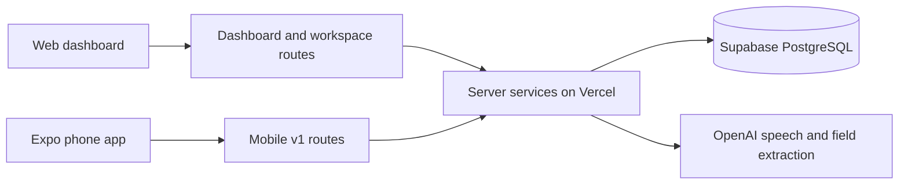

# What runs where

There is one backend: the Next.js application at the repository root, deployed to Vercel.
It serves both the website and the separate Expo app. Supabase hosts PostgreSQL; it does
not run the mobile app or the Next.js API code. The phone talks to Vercel over HTTPS and
never connects directly to the database or OpenAI.

| Code | Responsibility | Runs on |
| --- | --- | --- |
| `src/app/` pages, `src/components/` | Website UI and dashboard | Vercel rendering and the browser |
| `src/app/api/` | HTTP endpoints shared by the clients | Vercel server functions |
| `src/server/services/`, `src/server/workspace/` | Dashboard queries, tags, roster and workspace edits | Vercel |
| `src/server/mobile/` | Account/profile operations and transactional log/audio saves | Vercel |
| `src/server/recordings/` | Speech-to-text, structured extraction, validation, usage limits | Vercel |
| `src/server/db/` | Database connection, Drizzle schema and persistence setup | Server/operator scripts |
| `src/contracts/` | Serializable types and validation schemas shared across boundaries | Imported where needed; no credentials |
| `drizzle/`, `scripts/db/` | Reviewed migrations and operator setup | Locally with owner credentials |
| `mobile/src/` | Recording, playback, account editor, review form, durable local drafts | iPhone/Android |
| `shared/design/` | Common design tokens | Web and phone |

The website loads `/api/dashboard`, `/api/logs/:id`, `/api/tags`, and `/api/workspace`.
The phone uses `/api/mobile/v1/accounts`, `/logs`, `/recordings/:id`, and `/transcriptions`.
Both read and write the same farm, employees, fields and work logs. A phone log gets one
stable database ID, used by the collapsed and expanded website row.

An open dashboard also hears when that data changes: database triggers send a content-free
signal through Supabase Realtime, and the browser answers by re-reading the routes above.
No data travels over that channel and the phone is not involved; see
[dashboard live updates](backend/realtime.md).

A recording is processed into speech plus typed suggestions, reviewed on the phone, and
then explicitly saved. The transcription step does not silently insert a log. Device
storage retains drafts and audio during connection failures; it is not a second backend.

“Demo” used to distinguish the shared-account API from an unused future sign-in prototype.
That duplicate implementation, its routes/settings, and the native sample-recording mode
have been removed. Existing farm profiles share access without sign-in. Applied migration
filenames remain unchanged to preserve the database ledger. The Figma fixture and synthesized
sample recording remain clearly identified reference material.
